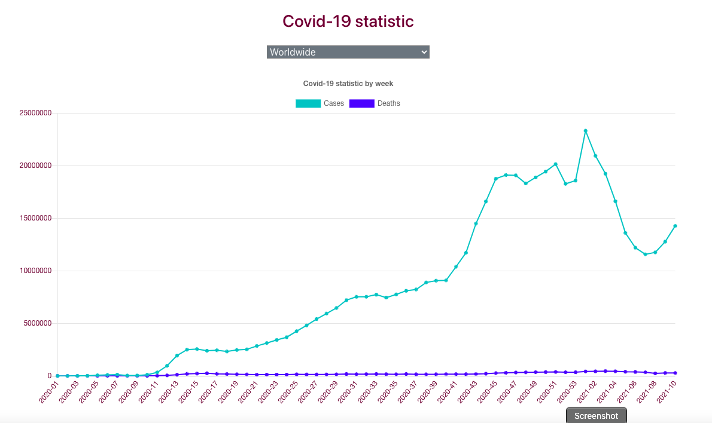
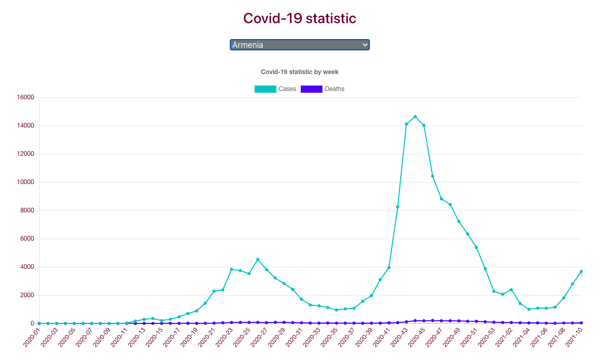
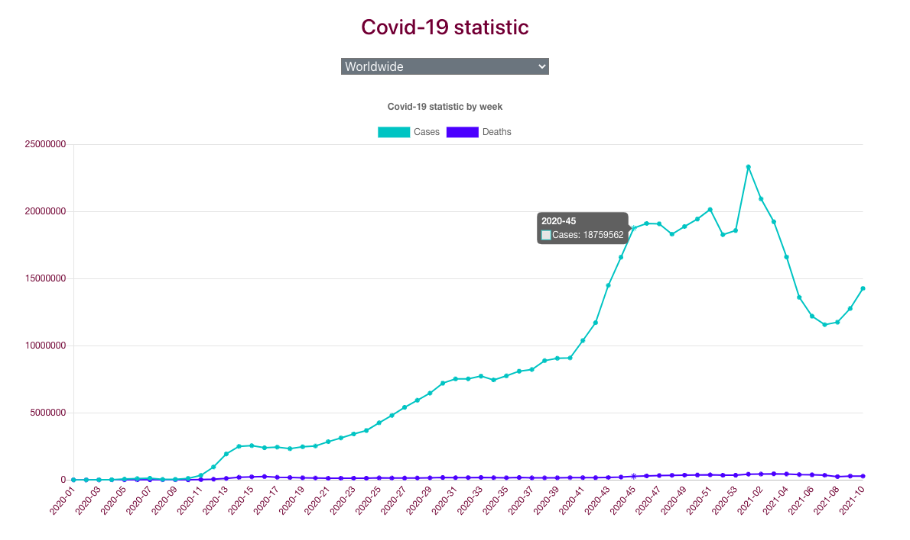

# covid-statistic

### Description
Covid-19 statistic   
cases and deaths per week  
worldwide and by country  
from API endpoint https://opendata.ecdc.europa.eu/covid19/nationalcasedeath/json/  

### Technology Stack
Component         | Technology
---               | ---
Frontend          | React 16+ 
Backend           | Spring Boot 2.1+, Java 11+
Database          | H2 Database
Server            | TomcatApache 9.+
API Documentation | Swagger-UI

### screenshots
Worldwide statistic info

By country statistic info

Tooltip information


### Prerequisites
-  Clone the repo `git clone https://github.com/VaivaSvegzdaite/covid-statistic.git`
-  To run application from war file:
```
mvn clean install org.codehaus.cargo:cargo-maven2-plugin:1.7.7:run -Dcargo.maven.containerId=tomcat9x -Dcargo.servlet.port=8080 -Dcargo.maven.containerUrl=https://repo1.maven.org/maven2/org/apache/tomcat/tomcat/9.0.40/tomcat-9.0.40.zip
```
- To make a war file (dis-app.war) in /target directory and deploy it to Tomcat server run `mvn clean install package` 

### Backend
- Go to your project folder from your terminal
- cd covid-app
- Run: `mvn spring-boot:run`

### Frontend
- Go to your project folder from your terminal
- cd ui
- Run: `npm install` or `yarn install`
- After install, run: `npm run start` or `yarn start`
- It will open your browser(http://localhost:3000)

### Database 
- http://localhost:8080/console
```
  datasource.url=jdbc:h2:file://tmp/
  username: sa
  password:
```

### Swagger UI
- http://localhost:8080/swagger-ui/

***
Copyright ©VaivaSvegzdaite, 2021
